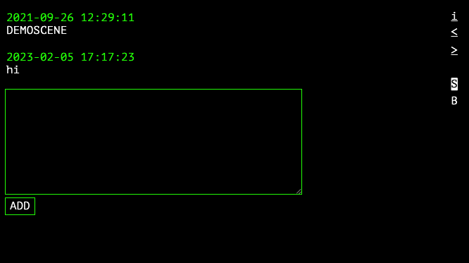
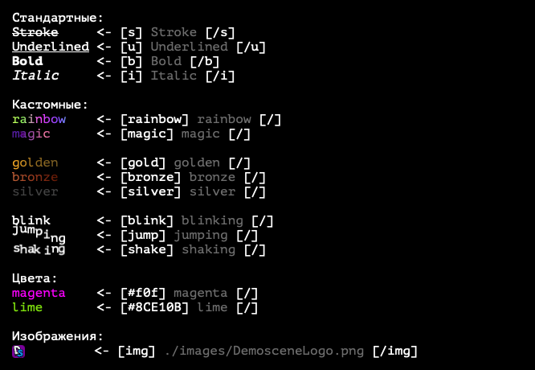
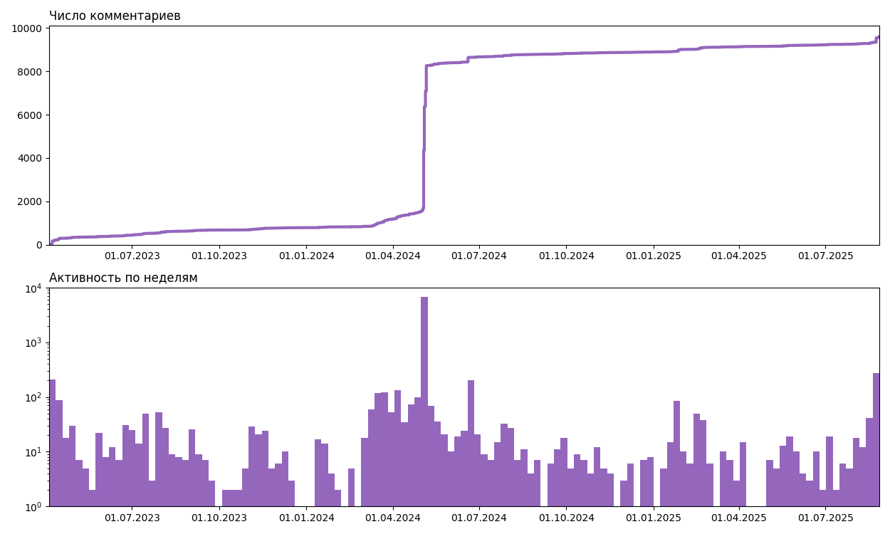

# Demoscene
Демосцена - сайт, где каждый может анонимно оставлять комментарии.
На сайте также есть разные модификаторы текста, чтобы было не так скучно.  



Реализованные модификаторы:  



Первый сезон проекта существовал на Heroku до того, как они отключили бесплатные аккаунты, второй сезон долго находился на Sprinthost пока не переехал на Nanohost.  

Итоги первого сезона на [webarchive](https://web.archive.org/web/20221130191402/https://demoscene.herokuapp.com/)  
Второй сезон на [сайте](https://tauceti.nhost.me/demoscene/)

Статистика за 125 недель:  



## Данные
Последняя версия использует PostgreSQL в качестве базы данных. Создание схемы описано ниже.  

```sql
CREATE DATABASE demoscene;
\c demoscene

CREATE TABLE comments (
  id SERIAL PRIMARY KEY,
  comment TEXT NOT NULL,
  birthtime TIMESTAMP(0) NOT NULL DEFAULT NOW()
);
```
